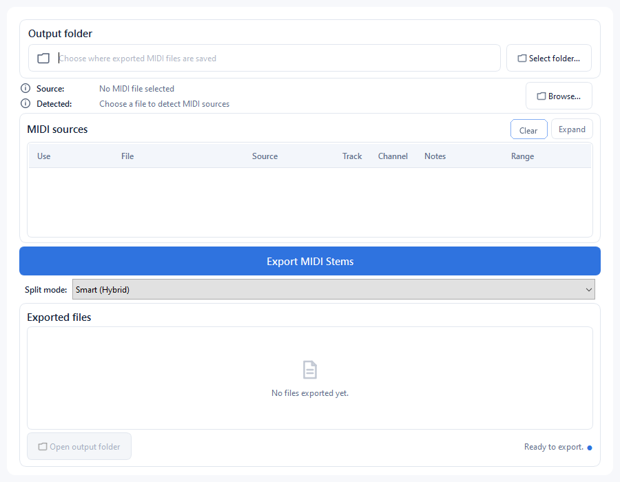

# Pattern Atlas

Offline Windows MIDI exporter for splitting one Standard MIDI File into organized stems.



## Features

- Split Type 0 and Type 1 `.mid` and `.midi` files by track, MIDI channel, or automatically
- Preserve notes, timing, tempo, and MIDI metadata
- Export each detected source as a separate `.mid` file
- Prevent incomplete output files when an export is interrupted
- Works offline
- Does not render audio or open DAW project files

## Usage

1. Open Pattern Atlas.
2. Browse for a MIDI file or drop one into the window.
3. Choose an output folder and split mode.
4. Click **Export MIDI Stems**.

## Split modes

- **Automatic** — chooses track or channel separation based on the file structure
- **By Track** — creates one stem per MIDI track
- **By MIDI Channel** — separates the channels found inside each source track and MIDI port

## Download

Download the portable Windows executable from the [Releases](https://github.com/viy2tek/Pattern-Atlas/releases) page. No Python installation is required.

## CLI

```powershell
midi-exporter song.mid -o output --mode auto
```

## Development

```powershell
python -m pip install -e ".[dev,build]"
python -m ruff check .
python -m pytest
.\build.ps1
```

Diagnostic logs are stored in `%LOCALAPPDATA%\Pattern Atlas\logs`.
