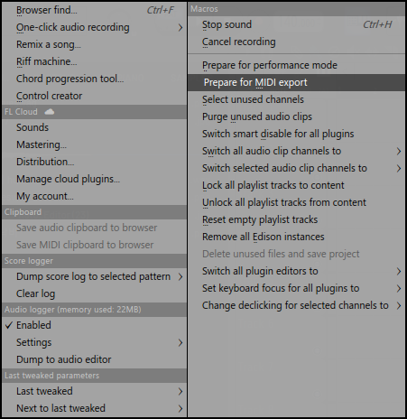
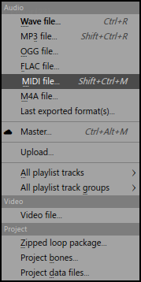

# Pattern Atlas

Offline Windows MIDI exporter for splitting one or many Standard MIDI Files into organized stems.

See the [release notes](https://github.com/viy2tek/Pattern-Atlas/releases) for updates.


## Features

- Split Type 0 and Type 1 `.mid` and `.midi` files with Smart (Hybrid), track, or MIDI channel modes
- Process multiple MIDI files or folders recursively in one batch
- Preview, expand, select, and rename detected MIDI sources before export
- Preserve notes, timing, tempo, and MIDI metadata
- Export each detected source as a separate `.mid` file
- Prevent incomplete output files when an export is interrupted
- Works offline
- Does not render audio or open DAW project files

## Usage

1. Open Pattern Atlas.
2. Browse for one or more MIDI files, or drop files/folders into the window.
3. Review the detected sources; uncheck any source you do not want and rename
   sources by double-clicking their name.
4. Choose an output folder and split mode.
5. Click **Export MIDI Stems**.

For a batch, each input receives its own folder below the selected output root,
such as `Song 01 - MIDI Stems` and `Song 02 - MIDI Stems`. Folders are scanned
recursively, and previously generated output folders are not processed again.

## Preparing a MIDI file in FL Studio

If an exported `.mid` file is empty, prepare the project for MIDI export before
saving it. Pattern Atlas can only split note events that are present in the
Standard MIDI file; it cannot recover notes that were not exported.

1. Open **Tools → Macros → Prepare for MIDI export**.

   

2. Export the prepared project with **File → Export → MIDI file…**.

   

3. Save the `.mid` file, then browse for it or drop it into Pattern Atlas.

This preparation step is specific to FL Studio. In other DAWs, use their MIDI
export workflow and confirm that the resulting file contains MIDI notes before
importing it.

## Split modes

- **Smart (Hybrid)** — keeps single-channel tracks together and splits multi-channel tracks by channel
- **By Track** — creates one stem per MIDI track
- **By MIDI Channel** — separates the channels found inside each source track and MIDI port

## Download

Download the latest portable Windows executable from the [latest release](https://github.com/viy2tek/Pattern-Atlas/releases/latest).

1. Download `Pattern-Atlas-X.Y.Z-Windows-x64.exe` from the release assets.
2. Open the executable directly. No installer or Python installation is required.

Older builds remain available on the [Releases](https://github.com/viy2tek/Pattern-Atlas/releases) page.

## Release automation

Release Please manages versions, tags, GitHub Releases, and `CHANGELOG.md` from
Conventional Commit pull request titles. A push to `master` creates or updates
one Release PR. Merging that PR creates a draft release and a `vX.Y.Z` tag.

The same workflow then runs lint checks and tests, builds the Windows
executable with `build.ps1`, adds the executable and its SHA-256 checksum to the
draft, and publishes only after both assets are present. A failed build or
upload leaves the release as a draft that can be retried safely.

For versions below `1.0.0`, normal features and fixes are patch releases.
Breaking changes advance the minor version and must be requested explicitly.
Do not edit version fields, `CHANGELOG.md`, tags, or releases manually.

The workflow uses `GITHUB_TOKEN` by default. Maintainers may add a fine-grained
`RELEASE_PLEASE_TOKEN` secret when Release Please PR checks must start without
manual approval. GitHub Actions must be allowed to create pull requests, and
branch protection should require **Tests** and **PR metadata** before merge.

Enable immutable releases in the repository settings after the first automated
release is verified. The published `.sha256` file verifies file integrity; it
does not remove Windows SmartScreen warnings or establish publisher trust.

## CLI

```powershell
midi-exporter song.mid -o output --mode smart
midi-exporter song-01.mid song-02.mid -o output --mode smart
midi-exporter .\midi-folder -o output --mode smart
```

## Development

```powershell
python -m pip install -e ".[dev,build]"
python -m ruff check .
python -m pytest
.\build.ps1
```

Diagnostic logs are stored in `%LOCALAPPDATA%\Pattern Atlas\logs`.
